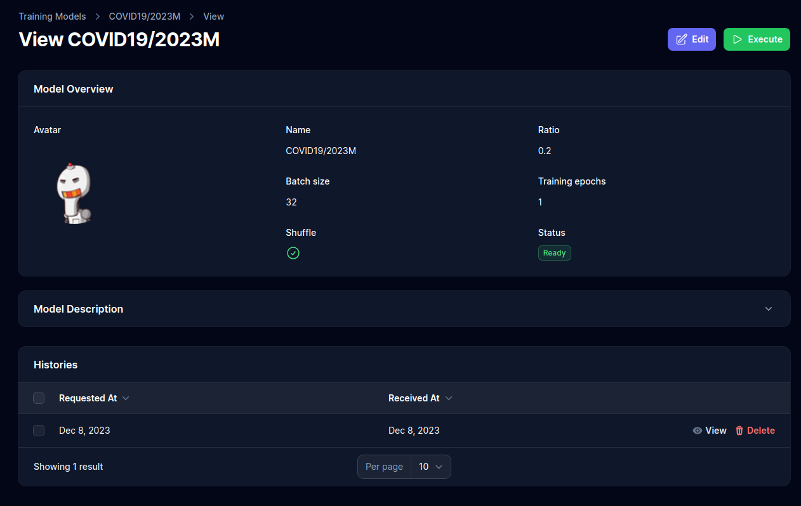

# Project Setup Guide

## Overview

A Machine Learning Models Builder and Manager built with [Laravel](https://laravel.com/), [Livewire](https://laravel-livewire.com/), [Tensorflow](https://tensorflow.org/) and [FastAPI](https://fastapi.tiangolo.com/), providing a set of features:

- A login system.
- The capability to create, manage, and utilize multiple datasets.
- The ability to train diverse models associated with various datasets asynchronously.
- Real-time notifications for ongoing model training or readiness for use.
- Instant notifications upon results becoming available.
- Comprehensive logs that showcase received results, along with search, filter, and deletion functionalities



## Manual Setup
> You can avoid this configurational step by using the [Docker installation process](#docker-setup).

Before setting up the project, make sure you have the required dependencies:

- **Python >= 3.10**
- **PHP >= 8.1**
- **pip**
- **composer**
- **npm**

### Installing Dependencies

>The following example works for Debian Based Linux Distributions.

Update the system

```bash
sudo apt update && sudo apt upgrade -y
```

Install Python

```bash
sudo add-apt-repository ppa:deadsnakes/ppa
sudo apt install python3.10
```

Install pip

```bash
sudo apt install python3-pip
```


Install PHP

```bash
sudo apt get install -y php8.1-cli php8.1-common php8.1-mysql php8.1-zip php8.1-gd php8.1-mbstring php8.1-curl php8.1-xml php8.1-bcmath
```

Install composer

```bash
curl -sS https://getcomposer.org/installer -o /tmp/composer-setup.php

sudo php /tmp/composer-setup.php --install-dir=/usr/local/bin --filename=composer
```

Install npm

```bash
sudo apt install nodejs npm
```

### Setting the Web Application

Make sure you are in the `web-app` directory

```bash
cd src/web-app
```

Install composer dependencies

```bash
composer install
```

Install npm dependencies and build the assets

```bash
npm install
npm run build
```

Create the `.env` file and generate the application encryption key

```bash
cp .env.example .env # dont forget to change database credentials 
php artisan key:generate
```

Update the `package.json` file by swapping the `scripts` section with the one below

```json
"scripts": {
    "dev": "vite",
    "build": "vite build"
},
```

### Setting the Model

There are at least two ways to setup python dependencies, globally or in a virtual environment.

1. #### Create a new venv (recommended if you want to isolate the dependencies)
```bash
python3 -m venv venv
source venv/bin/activate
pip install --require-virtualenv --no-cache-dir --upgrade -r dockerfiles/ml-model/requirements.txt 
```

2. #### Install all the requirements globally (recommended if you dont use any other machine learning projects)

```bash
pip install --no-cache-dir --upgrade -r dockerfiles/ml-model/requirements.txt
```

### Running the project

Start the model

```bash
cd src/ml-model

uvicorn home:app --host 127.0.0.1 --port 5000 --reload
```

Start the built-in web server

```bash
cd src/web-app

php artisan serve
```

If you want to expose the dev server to any other than localhost, you can use the following command


```php
php artisan serve --host <your-ip> --port <your-port>
```

To expose the server to the world (maybe requires port forwarding or firewall configuration)
```php
php artisan serve --host 0.0.0.0 --port <your-port>
```


However Most of the features are available at /admin and to access it you must
create a user using the following command:

```php
php artisan make:filament-user --email yourmail --password yourpass --name you
```


## Docker Setup

>Make sure Docker is installed.

>If you are using a Windows 10/11, you need to know that Windows uses WSL (Windows Subsystem for Linux), which is a layer between Windows and Linux, this makes Docker slow and browser requests may take 30-60 seconds to be completed.

Spin up the containers

```bash
docker-compose up -d --build app
```

Running the command will expose 3 services with the following ports:

- **Nginx** - `:80`
- **PHP** - `:9000`
- **FastAPI** - `:5500`

Install composer dependencies

```bash
docker-compose run --rm composer install
```

Install npm dependencies and build the assets

```bash
docker-compose run --rm npm install
docker-compose run --rm --service-ports npm run build
```

Create the `.env` file and generate the application encryption key

```bash
cp .env.example .env
docker-compose run --rm php artisan key:generate
```

You can now access the server at [http://localhost](http://localhost).
